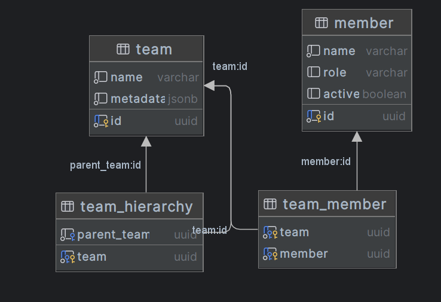

# Welcome to Remix!

Start the postgres database

```shellscript
docker compose up -d
```

Install dependencies

```shellscript
npm i
```

Run the dev server:

```shellscript
npx remix vite:dev
```

## Answers:

### Any design/technical decisions made

Everything straitforward here (remix, postgres.js, nextui)

I opted for 4 table:


This allow the MCD to support the following feature:

- Members can have multiple team
- Team can have multiple parent team (for upcoming update)

> I didn't have the time to complete the assignement, the following feature are missing:

- Manage team members
- Edit team details
- Handle member role changes

This would have required an additionnal hour to complete

> I didn't put any Tests as i would not have the time to setup the environment in the 5 hours

> 

### Query design decisions

I wanted the team query to return all teams and members in a single query

```sql
    SELECT
      t.id as id , t.name as name, t.metadata as meta,
      m.id as memberid, m.name as membername, m.role as memberrole, m.active as memberactive,
      parent_team
    FROM team t
    LEFT JOIN team_member tm ON t.id = tm.team
    LEFT JOIN member m ON m.id = tm.member
    LEFT JOIN team_hierarchy h ON t.id = h.team
```

This will return a row per team member that I can post-process by the server before return the request
`LEFT JOIN team_hierarchy h ON t.id = h.team` will duplicate the results if team can have mulitple parent, causing mulitple team member

### Notes on production deployment considerations

Deployment would be fairly easy:

1. I would rely on GCP Cloud Run, which allow container to run in KNative (serverless kubernetes environement) and a hosted postgres instance
2. Disable the database Seeding on prod startup
3. Add a github CI which build the remix app, and put it in a docker container
4. Push the container on a docker reposiutory
5. Add a pulumi/terraform folder in this project, which is also deployed by the CI:
6. Setup the project in Cloud provider
7. Create VPC & subnet for private connectection between server and PG
8. Create & Store the database secrets
9. Define the Cloud Run ressource, which get the new docker image tag on update, and the database secret injects in place of the .env file
10. Define the Ingress & Domain configuration

It also needs the authentication & authorization, to restrict access to the data and team modification
